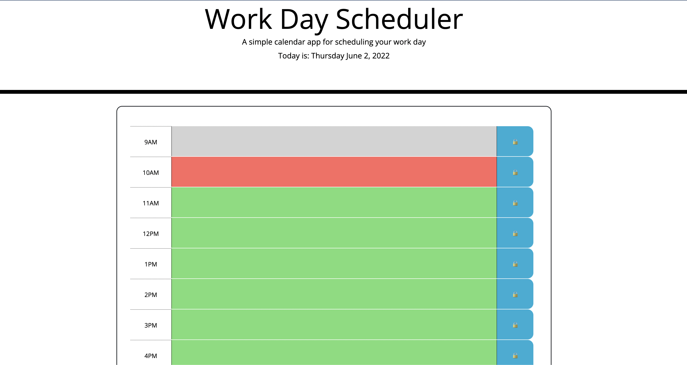

# Weekly Planner

This application is a calendar that allows you to save events for each hour of the day.

## Demo

https://wtguenthner.github.io/Weekly_Planner/

## Screenshots

## Lessons Learned

In order to complete this project, an understanding of local storage was needed in order to accept the user 
information and store it for future use as well as the ability to generate the current date and display it 
to the user.

## 🔗 Links

